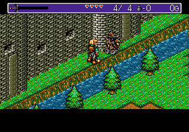
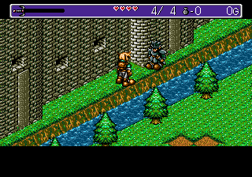

# Fix soldier palette

Original            |  Fixed
:-------------------------:|:-------------------------:
 | 

## Technical notes

Updated sprite data to use palette 1 by changing bits 6-7 of the second byte.

_ | _            |  _
:-------------------------:|:-------------------------:|:-------------------------:
Data | 939D200014328300 | 935D200014328300
Byte 2 | 10 (2) 011101 | 01 (1) 011101
  

## Offset

Rom            |  _
:-------------------------:|:-------------------------:
Europe| $0215A6
France| $02159A
Germany| $0215A0
Japan| $021552
USA| $0215A6
